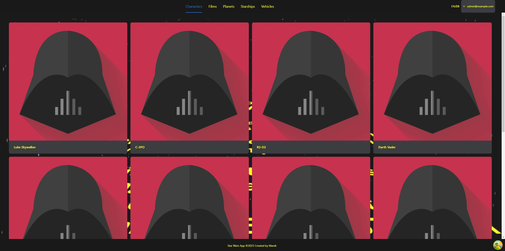
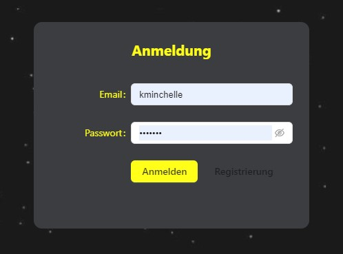

# StarWars App

## General Info

Star-Wars fanpage project using https://swapi.dev/ API and custom API for authentication.

## Technologies

Project is created with:

- TypeScript
- ReactJS
- React Router - Client Side Routing, Layout.
- React Query - Asynchronous state management, server state management.
- i18next - internationalization-framework.
- Styled Components
- Ant Design
- https://swapi.dev/ - Free Star-wars API
- custom API for authentication purpose (NodeJS)

## Content

### Layout

Page layout based on Outlet from React Router and components from Ant Design library.

### Authentication

Bearer authentication for authorizing HTTP requests based on the existence and validity of a bearer token.

The login panel shows up when trying to access the website. With bearer authentication, the content of the website is available only to logged-in users.

Registration for new users.

### i18next

In this project i'm using i18next an internationalization-framework.

 

A short example of changing the language.

### Styling

Project is styled mainly with Styled Components but also with Config Provider from Ant Design library.

## Project Status

The project is still being developed.

## Author

Marek Parczyk
